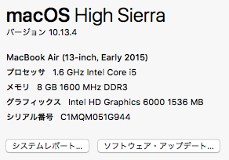

## 計測方法

timeコマンドを用いて，goのプログラムに対して 5000個から25000個の実行時引数を与え，
そのときの実行速度を計測する．

## 計測環境



## 計測項目

|項目|意味|
|---|---|
|real|プログラムの呼び出しから終了までにかかった実時間（秒）|
|user|プログラム自体の処理時間（秒）（ユーザCPU時間）|
|sys |プログラムを処理するために、OSが処理をした時間（秒）（システム時間）|


## 計測結果

|引数の数|bad|good|
|---|---|---|
|5000|real 0.37<br />user 0.27<br />sys 0.20<br /> |real 0.32<br /> user 0.25<br /> sys 0.18<br />|
|10000|real 0.39<br /> user 0.30<br /> sys 0.21<br />| real 0.33<br /> user 0.27<br /> sys 0.18<br />|
|15000|real 0.42<br /> user 0.36<br /> sys 0.20<br />| real 0.35<br /> user 0.29<br /> sys 0.19<br />|
|20000| real 0.46<br /> user 0.45<br /> sys 0.20<br />| real 0.36<br /> user 0.29<br /> sys 0.18<br />|
|25000| real 0.57<br /> user 0.53<br /> sys 0.22<br />| real 0.36<br /> user 0.30<br /> sys 0.19<br />|

### グラフ


#### 生データ

```
    ch1/prac1.3  master   bash bench.sh
5000
bad
real 0.37
user 0.27
sys 0.20
good
real 0.32
user 0.25
sys 0.18
10000
bad
real 0.39
user 0.30
sys 0.21
good
real 0.33
user 0.27
sys 0.18
15000
bad
real 0.42
user 0.36
sys 0.20
good
real 0.35
user 0.29
sys 0.19
20000
bad
real 0.46
user 0.45
sys 0.20
good
real 0.36
user 0.29
sys 0.18
25000
bad
real 0.57
user 0.53
sys 0.22
good
real 0.36
user 0.30
sys 0.19
```
